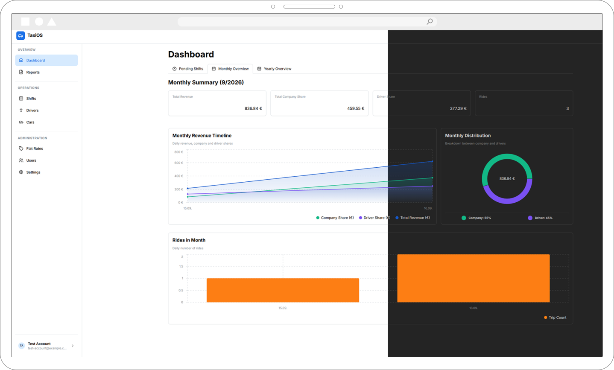
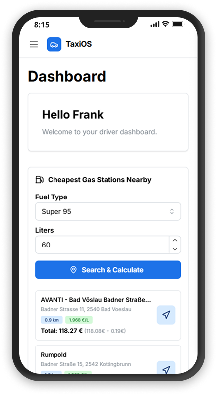
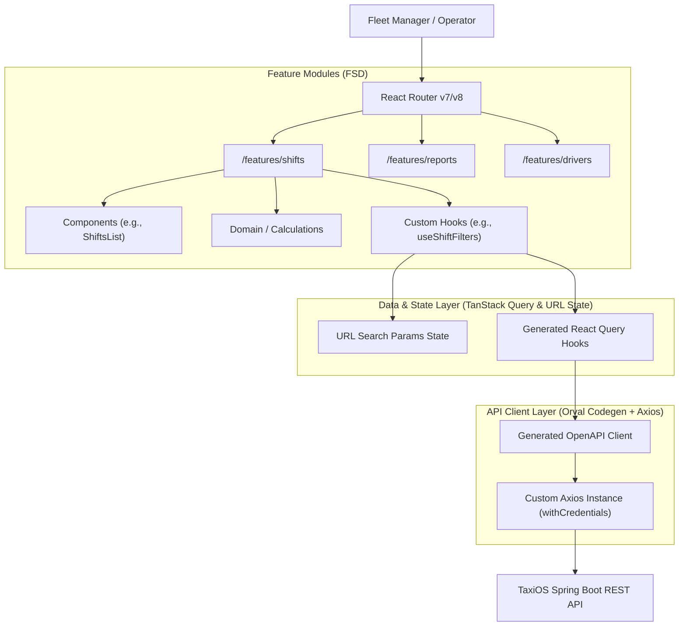

# TaxiOS Frontend

> **Origin Story:** TaxiOS was born out of a real-world business need: eliminating the administrative pain of manually entering hundreds of paper shift slips into Excel each month. What started as a digitization initiative for a local taxi company has evolved into a production-ready, multi-tenant platform. Today, it actively manages daily operations for a primary tenant with 10+ drivers, fully automating revenue tracking, contract remuneration, and financial reporting. The platform is currently being expanded to include comprehensive fleet management, automated shift scheduling, and detailed cost analytics.

### Quick Overview
- **Multi-Tenant UI:** Dedicated workspaces for multiple independent taxi companies on a single platform.
- **Automated Payroll Engine:** Seamlessly handles complex driver remunerations (percentage, fixed, weekly) directly within shift submissions.
- **Real-time Analytics:** Interactive dashboard KPIs and multi-dimensional reporting (by driver, car, date).
- **OpenAPI Contracts:** Fully type-safe API client and React Query hooks auto-generated via Orval from the backend specification.
- **CI/CD Pipeline:** Automated testing, linting, and continuous deployment via GitHub Actions.
- **Infrastructure & Environments:** Containerized frontend served via Nginx, hosted on a VPS with distinct staging and production environments.

### Live Stage Environment & API Documentation

| Resource              | Link                                                                                              |
| :-------------------- | :------------------------------------------------------------------------------------------------ |
| **Swagger API Docs**  | [https://taxi-stage.mk0.me/api/swagger-ui](https://taxi-stage.mk0.me/api/swagger-ui/index.html#/) |
| **Stage Environment** | [https://taxi-stage.mk0.me](https://taxi-stage.mk0.me)                                            |

> **Demo Credentials**
> - **Admin:** `test-account@example.com` / `TestAccount246#`
> - **Driver:** `lukas.gruber@example.com` / `12341234`

### Live Monitoring

| Resource              | Link                                                             |
| :-------------------- | :--------------------------------------------------------------- |
| **Grafana Dashboard** | [https://taxi-monitoring.mk0.me](https://taxi-monitoring.mk0.me) |

> **Demo Credentials**
> - **Grafana:** `taxiosstageuser` / `12341234`

<br/>

|                Admin Dashboard Desktop View                 |                     Driver Dashboard Mobile View                     |
| :---------------------------------------------------------: | :------------------------------------------------------------------: |
|  |  |

<br/>

**Repositories:**

- **Frontend:** https://github.com/markokosic/taxios-frontend-web
- **Backend:** https://github.com/markokosic/taxios-backend _(Java 21 / Spring Boot REST API & PostgreSQL Multi-Tenancy)_

---

## Table of Contents

- [Core Features](#core-features)
- [Tech Stack](#tech-stack)
- [System Architecture & Data Flow](#system-architecture--data-flow)
- [Engineering Decisions & Highlights](#engineering-decisions--highlights)
- [Feature Backlog](#feature-backlog)
- [Quickstart & Development](#quickstart--development)

---

## Core Features

### 1. Complex Revenue & Shift Tracking

_Context: The traditional paper shift-slip process is highly prone to manual calculation errors and data loss._

- **Granular Shift Logging:** Mobile-first and desktop entry forms for daily shift earnings (cash, card, tips), precise odometer readings (`kilometersDriven`), and timeframes.
- **Multi-Stage Approval Workflow:** Shifts are not just blindly saved; they traverse a strict lifecycle (State Machine). Submitted shifts undergo mandatory control stages to prevent data entry errors before they are officially accepted and finalized by administrative roles.
- **Flat Rates Engine:** Drivers can add predefined flat-rate trips (e.g., standardized airport transfers) directly into their shift reports alongside regular metered single rides.

### 2. Dynamic Driver Remuneration Engine

_Context: Taxi drivers operate under vastly different contract models, making manual payroll a nightmare._

- **Automated Payout Splits:** The system instantly calculates cent-accurate driver payouts vs. net company retention based on the driver's active contract rules.
- **Polymorphic Contracts:** Supports multiple models seamlessly:
  - **Percentage Share (`PERCENTAGE_SHARE`):** Configurable driver percentage with an optional minimum guaranteed payout.
  - **Weekly Fixed Rate (`WEEKLY_FIXED_RATE`):** Fixed weekly company rent fee tracking.
  - **Flat Rate (`FLAT_RATE`):** Fixed daily shift fee.

### 3. Multi-Tenant User Management

_Context: Taxi fleets need multiple administrative and operational users without compromising data isolation._

- **Strict Data Isolation:** JWT-based authentication ensures that each taxi company (tenant) operates in a completely isolated workspace.
- **Fixed System Roles:** The system enforces strict access control via pre-defined roles (`OWNER`, `ADMIN`, `DRIVER`). Owners and Admins manage the fleet and view global analytics, while Drivers get a restricted dashboard variant focused solely on their own shift tracking.

### 4. Fleet Asset Management

_Context: Vehicle operating costs and shift tracking must be clearly linked to identify unprofitable assets._

- **Vehicle Inventory:** Centralized registry of license plates, VINs, horsepower, and operational statuses (`ACTIVE`, `MAINTENANCE`).
- **Shift Linkage:** Users manually assign active vehicles to their shifts from the centralized registry, ensuring accurate "revenue per car" tracking without data duplication.

### 5. Financial Analytics & Reporting

_Context: Fleets need to identify month-over-month growth and profitable entities at a glance._

- **Multi-Dimensional Grouping:** Generate financial reports dynamically grouped by `DRIVER`, `CAR`, or `DATE`.
- **Dashboard KPIs:** Real-time overview of total gross revenue, company share, driver payouts, and active vehicle count for current and past periods.

### 6. Data Versioning & Audit Trail

_Context: Financial and payroll data must be tamper-proof and fully traceable for tax and accounting purposes._

- **Immutable History:** All shift entries, contracts, and core entities are strictly versioned.
- **Traceability:** Modifications do not silently overwrite historical data. The system maintains a complete audit trail to guarantee compliance and transparency for fleet operators.

---

## Tech Stack

| Domain                      | Technology              | Version    | Role / Description                                                                 |
| :-------------------------- | :---------------------- | :--------- | :--------------------------------------------------------------------------------- |
| **Frontend Framework**      | React                   | `^19.3.0`  | UI component rendering                                                             |
| **Build Tooling**           | Vite                    | `^8.3.0`   | Dev server & production bundler                                                    |
| **Language**                | TypeScript              | `~6.0.0`   | Static typing & type safety                                                        |
| **UI Components & Styling** | Mantine UI              | `^9.6.1`   | Component library & styling (`@mantine/core`, `@mantine/dates`, `@mantine/charts`) |
| **State & Data**            | TanStack React Query    | `^5.102.8` | Server-state management & cache lifecycle                                          |
| **Routing**                 | React Router            | `^8.3.1`   | Client-side SPA routing                                                            |
| **Form Handling**           | React Hook Form         | `^7.88.0`  | Form state & validation                                                            |
| **Schema Validation**       | Zod                     | `^4.6.2`   | Runtime data validation & schema inferencing                                       |
| **API Codegen**             | Orval                   | `^8.32.0`  | OpenAPI 3.0 codegen for React Query & Zod                                          |
| **HTTP Client**             | Axios                   | `^1.20.0`  | Interceptors for session handling & errors                                         |
| **Localization**            | i18next / react-i18next | `^26.4.2`  | Multi-language support and translation management                                  |
| **Testing**                 | Vitest / MSW            | `^5.0.0`   | Unit testing and API mocking via Service Workers                                   |
| **Backend Runtime**         | Java 21 / Spring Boot   | `3.5.4`    | REST API providing OpenAPI 3.0 specs, JWT auth & business logic                    |
| **Database**                | PostgreSQL              | `15+`      | Multi-tenant database with strict row-level `@TenantId` data isolation             |
| **CI / CD**                 | GitHub Actions          | `--`       | Automated testing, linting, and production deployment                              |

---

## System Architecture & Data Flow

### Frontend Architecture (Feature-Sliced Design)

The codebase is organized using a **Feature-Sliced Design (FSD-lite)** architecture, strictly separating domains (`shifts`, `reports`, `users`, `flatrates`, `drivers`) into self-contained modules (`src/features/*`) containing their own `components`, `hooks`, `domain` logic, and `pages`. Cross-cutting concerns are kept in `src/shared`.



---

## Engineering Decisions & Highlights

Here is a simple overview of the core architectural decisions that drive the frontend:

### 1. Feature-Sliced Design (FSD-lite)

- **Implementation:** Code is grouped by business features (like `shifts` or `reports`) rather than file types (like `components` or `hooks`).
- **Impact:** Keeps the codebase clean. When adding new features, you don't accidentally break existing ones (no "components spaghetti").

### 2. Contract-Driven API (`Orval` + `Axios`)

- **Implementation:** API clients, React Query hooks, and TypeScript types are auto-generated directly from the backend's OpenAPI spec.
- **Impact:** 100% type safety. If the backend changes, the frontend build fails immediately instead of crashing in production.
- **Trade-off:** Running `npm run api:generate` is required manually whenever the backend API changes.

### 3. Server-State over Global State (`TanStack Query`)

- **Implementation:** React Query handles almost all state management, taking care of caching, fetching, and background updates natively.
- **Impact:** Completely eliminates the need for complex, boilerplate-heavy global stores like Redux or Zustand.

### 4. URL-Driven State Management

- **Implementation:** Filters, pagination, and search queries are stored directly in the URL instead of React state.
- **Impact:** Users can bookmark, share, and refresh complex report pages without ever losing their active filters.

### 5. Client-Side Domain Aggregation

- **Implementation:** Complex math (like revenue splits and flat rates) is calculated in the frontend to keep the backend API simple for the MVP.
- **Impact:** Very fast feature development, as frontend devs can iterate on logic without waiting for backend API updates.

### 6. Robust UI Patterns & Infinite Scrolling

- **Implementation:** The app leverages React Query combined with Intersection Observers for smooth infinite scrolling on large lists.
- **Impact:** A consistent user experience. Users always see proper skeleton loaders while waiting and clean error states if something fails.

---

## Feature Backlog

- **Shift Planning & Calendar:** Interactive calendar for scheduling upcoming shifts, assigning vehicles, and providing driver-specific views for their upcoming work schedule.
- **Cost Center Controlling & P&L:** Comprehensive tracking of vehicle expenses (fuel, maintenance, insurance), payroll overhead, and automated Net Income calculation.
- **Tax & Collective Agreement Compliance:** Robust handling of regional tax brackets, tax-free allowances, and strict adherence to mandatory collective wage agreements (*Kollektivverträge*).
- **Advanced RBAC (Role-Based Access Control):** Fine-grained permissions and custom roles (e.g., `ADMIN`, `ACCOUNTANT`, `DISPATCHER`, `DRIVER`) for secure fleet management.
- **Payment Integration:** Automated billing, digital driver payouts, and subscription management via third-party providers (e.g., Stripe, SEPA).
- **Advanced Analytics & Reporting:** Interactive dashboard KPIs, graphical revenue statistics, and formal PDF/CSV exports (e.g., DATEV) for seamless bookkeeping.
- **Shift Handover & Telematics:** Odometer tracking, damage reporting, and automated taximeter data ingestion.

---

## Quickstart & Development

### Prerequisites

- **Node.js**: `>= 20.0.0`
- **npm**: `>= 10.0.0`

### 1. Local Setup

Clone the repository and install dependencies:

```bash
git clone https://github.com/markokosic/taxios-frontend-web.git
cd taxios-frontend-web
npm install
```

Create a `.env` file in the root directory:

```env
# Point to your local Spring Boot backend or staging server
VITE_API_URL=http://localhost:8080
```

> **Note:** The frontend requires a running backend API (Spring Boot + PostgreSQL). Ensure the backend service is running locally or point `VITE_API_URL` to a remote environment (e.g. Staging).

### 2. Development Mode

```bash
npm run dev
```

App will be accessible at `http://localhost:5173`.

### 3. Build & Scripts

- **Generate API Client:** `npm run api:generate` (compiles `openapi.json` specs to Orval hooks)
- **Run Unit Tests:** `npm run test`
- **Linting:** `npm run lint`
- **Production Build:** `npm run build`
