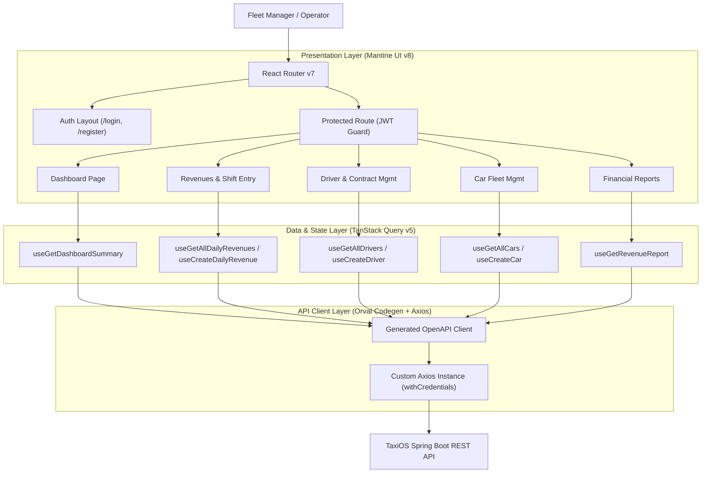

# TaxiOS Backoffice System

Backoffice platform for managing taxi fleets, shift revenues, driver remuneration models, and financial reports.

### Live Stage Environment & API Documentation

| Resource                | Link |
|:------------------------| :--- |
| **Swagger API Docs**    | [https://taxi-stage.mk0.me/swagger-ui](https://taxi-stage.mk0.me/swagger-ui/index.html#/) |
| **Stage Environment** | [https://taxi-stage.mk0.me](https://taxi-stage.mk0.me) |

> **Demo Credentials**
> - **Email:** `test@tenant.com`
> - **Password:** `TestTenant123`

**Repositories:**

- **Frontend:** https://github.com/markokosic/taxios-frontend-web
- **Backend:** https://github.com/markokosic/taxios-backend _(Java 21 / Spring Boot REST API & PostgreSQL Multi-Tenancy)_

---

## Table of Contents

- [Business Problem & Solution](#business-problem--solution)
- [Core Features](#core-features)
- [Tech Stack](#tech-stack)
- [System Architecture & Data Flow](#system-architecture--data-flow)
- [Engineering Highlights](#engineering-highlights)
- [Key Architectural Decisions & Trade-offs](#key-architectural-decisions--trade-offs)
- [Quickstart & Development](#quickstart--development)
- [Feature Backlog](#feature-backlog)

---

## Business Problem & Solution

Operating a taxi fleet involves daily bookkeeping, handling multiple payment methods (cash, card, tips), managing different driver contract models, and tracking vehicle costs across multi-tenant environments.

1. **Revenue Tracking & Driver/Company Payout Splits**
   - _Problem:_ Drivers operate under varied contract models (percentage split, weekly fixed fee, daily flat rate). Manual calculation of driver payouts and company retention in spreadsheets is time-consuming and error-prone.
   - _Solution:_ Daily shift revenue logging (cash, card, tips). The system automatically calculates cent-accurate driver payouts and net company shares based on each driver's assigned remuneration contract.

2. **Fleet & Driver Management**
   - _Problem:_ Vehicle operating costs and driver expenses are often bundled together, making cost allocation and shift tracking unclear.
   - _Solution:_ Clear separation of vehicle assets (cars) and human resources (drivers) for shift and cost assignment.

3. **Financial Reporting & Multi-Tenancy**
   - _Problem:_ Lack of clear insights into monthly or yearly revenue trends, car/driver performance, and isolated multi-tenant data management.
   - _Solution:_ Reports over customizable date ranges with dynamic grouping by `DRIVER`, `CAR`, or `DATE`, backed by tenant-isolated data.

---

## Core Features

### Revenue Tracking & Shift Management

- **Shift Revenue Logging:** Single and bulk entry of daily shift earnings (cash, card, tips), mileage (`kilometersDriven`), trip count, and shift timeframes (`drivenFrom` to `drivenTo`).
- **Automated Payout & Revenue Split:** Instantly calculates the exact driver payout vs. net company share according to the driver's active contract rules.

### Driver & Contract Management

- **Driver Profiles:** Manage driver contact details and operational statuses (`ACTIVE`, `INACTIVE`).
- **Remuneration Models:**
  - **Percentage Share (`PERCENTAGE_SHARE`):** Configurable driver percentage (e.g. 50%) with optional minimum guaranteed payout (`minDriverPayout`).
  - **Weekly Fixed Rate (`WEEKLY_FIXED_RATE`):** Fixed weekly company fee + designated settlement day (1–7).
  - **Flat Rate (`FLAT_RATE`):** Fixed daily shift fee.

### Fleet Asset Management

- **Vehicle Inventory:** License plate, make, model, model year, VIN, horsepower, and status (`ACTIVE`, `MAINTENANCE`, `INACTIVE`).
- **Shift Linkage:** Dynamic assignment of vehicles to driver shifts during daily revenue entry.

### Reports & Analytics

- **Dashboard Summary:** Overview of total gross revenue, company share, driver payouts, and active vehicle count for the current month and year.
- **Filterable Reports:** Generate financial reports filtered by date range (`dateFrom` to `dateTo`), specific drivers, or vehicles.
- **Multi-Dimensional Grouping:** Group report data dynamically by `DRIVER`, `CAR`, or `DATE`.

---

## Tech Stack

| Domain                      | Technology            | Version         | Role / Description                                                                 |
| :-------------------------- | :-------------------- | :-------------- | :--------------------------------------------------------------------------------- |
| **Frontend Framework**      | React                 | `^19.2.0`       | UI component rendering                                                             |
| **Build Tooling**           | Vite                  | `^7.2.4`        | Dev server & production bundler                                                    |
| **Language**                | TypeScript            | `~5.9.3`        | Static typing & type safety                                                        |
| **UI Components & Styling** | Mantine UI            | `^8.3.14`       | Component library & styling (`@mantine/core`, `@mantine/dates`, `@mantine/charts`) |
| **State & Data**            | TanStack React Query  | `^5.90.10`      | Server-state management & cache lifecycle                                          |
| **Routing**                 | React Router          | `^7.9.6`        | Client-side SPA routing                                                            |
| **Form Handling**           | React Hook Form       | `^7.66.1`       | Form state & validation                                                            |
| **Schema Validation**       | Zod                   | `^4.1.12`       | Runtime data validation & schema inferencing                                       |
| **API Codegen**             | Orval                 | `^8.20.0`       | OpenAPI 3.0 codegen for React Query & Zod                                          |
| **HTTP Client**             | Axios                 | `^1.13.2`       | Interceptors for session handling & errors                                         |
| **Backend Runtime**         | Java 21 / Spring Boot | `3.5.4`         | REST API providing OpenAPI 3.0 specs, JWT auth & business logic                    |
| **Database**                | PostgreSQL            | `15+`           | Multi-tenant database with strict row-level `@TenantId` data isolation             |
| **CI / CD**                 | GitHub Actions        | `--`            | Automated testing, linting, and VPS deployment                                     |
| **Deployment & Hosting**    | Docker, Nginx & VPS   | `stable-alpine` | Containerized web server deployed on a Linux VPS via Docker Compose                |

---

## System Architecture & Data Flow

### Frontend Architecture



---

## Engineering Highlights

1. **Contract-Driven API Integration & End-to-End Type Safety (`Orval` + `Axios`)**
   The frontend is built adhering to a strict Contract-Driven Development workflow. Configured in `orval.config.ts` to compile the backend's `openapi.json` specifications directly into strongly typed TanStack React Query hooks and Zod schemas, guaranteeing complete client-server type synchronization without manual interface maintenance.

2. **Type-Safe Remuneration Models**
   Driver remuneration configurations use TypeScript Discriminated Unions combined with Zod Schemas (`remuneration-schemas.ts`):
   - `PERCENTAGE_SHARE`: Validates `driverRevenueSharePercentage` (0–100%) and `minDriverPayout`.
   - `WEEKLY_FIXED_RATE`: Validates `weeklyFixedCompanySettlement` and `settlementDay` (1–7).
   - `FLAT_RATE`: Validates `driverFlatRatePayoutPerShift`.

3. **Multi-Tenancy Data Isolation**
   Seamless integration with the backend's multi-tenant architecture. Requests automatically pass JWT tenant tokens via custom Axios interceptors, which the backend uses to enforce strict row-level `@TenantId` data isolation in PostgreSQL per organization.

4. **Server-State Management**
   TanStack React Query v5 manages query invalidation (`queryClient.invalidateQueries`) and caching for fast UI feedback when recording shifts or drivers.

5. **Global 401 Session Interceptor**
   The custom Axios mutator (`custom-instance.ts`) intercepts `401 Unauthorized` responses, clears the query cache, and redirects unauthenticated sessions to `/login`.

---

## Key Architectural Decisions & Trade-offs

| Decision                                                    | Alternative Considered                     | Rationale & Impact                                                                                                                                                                                                                                                                                                                      |
| :---------------------------------------------------------- | :----------------------------------------- | :-------------------------------------------------------------------------------------------------------------------------------------------------------------------------------------------------------------------------------------------------------------------------------------------------------------------------------------- |
| **Contract-Driven Codegen (`Orval`) vs. Manual API Typing** | Handwritten Axios wrappers & TS Interfaces | **Rationale:** Guarantees 100% type safety synchronized with the Spring Boot backend contract. Prevents silent runtime API interface breakage.<br/>**Trade-off:** Requires running `npm run api:generate` whenever the backend OpenAPI spec updates.                                                                                    |
| **Zod Discriminated Unions vs. Separate REST Endpoints**    | Polymorphic endpoints per contract model   | **Rationale:** Driver remuneration models (`PERCENTAGE_SHARE`, `WEEKLY_FIXED_RATE`, `FLAT_RATE`) are handled via a unified API endpoint with dynamic discriminated union validation in `remuneration-schemas.ts`. Keeps form handling lean and dynamic.<br/>**Trade-off:** Requires conditional Zod validation schemas on the frontend. |
| **TanStack Query (Server State) vs. Global Redux Store**    | Centralized global state (Redux / Zustand) | **Rationale:** 95% of frontend state is asynchronous server state (shift logs, drivers, vehicles). TanStack Query handles caching, background refetching, and cache invalidation natively without state store boilerplate.<br/>**Trade-off:** Ephemeral UI state (modals, active filters) is handled in component-level state.          |

---

## Quickstart & Development

### Prerequisites

- **Node.js**: `>= 20.0.0`
- **npm**: `>= 10.0.0`

### 1. Local Setup

Clone the repository and install dependencies:

```bash
git clone https://github.com/markokosic/taxios-frontend-web.git
cd taxios-frontend-web
npm install
```

Create a `.env` file in the root directory:

```env
# Point to your local Spring Boot backend or staging server
VITE_API_URL=http://localhost:8080
```

> **Note:** The frontend requires a running backend API (Spring Boot + PostgreSQL). Ensure the backend service is running locally or point `VITE_API_URL` to a remote environment (e.g. Staging).

### 2. Development Mode

```bash
npm run dev
```

App will be accessible at `http://localhost:5173`.

### 3. Build & Scripts

- **Generate API Client:** `npm run api:generate` (compiles `openapi.json` specs to Orval hooks)
- **Run Unit Tests:** `npm run test`
- **Linting:** `npm run lint`
- **Production Build:** `npm run build`

---

## Feature Backlog

- **Total Cost Overview:** Comprehensive tracking of vehicle expenses (fuel/charging, maintenance, insurance, leasing), payroll/labor overhead (social security, fixed salaries), and general company costs.
- **Profit Report:** Profitability and net income analysis comparing gross revenue against operational expenses.
- **Dashboard KPIs:** Enhanced key performance indicators (e.g. daily average revenue `averageDailyRevenue`, revenue per kilometer `revenuePerKm`, stacked revenue distribution, and month-over-month growth trends).
